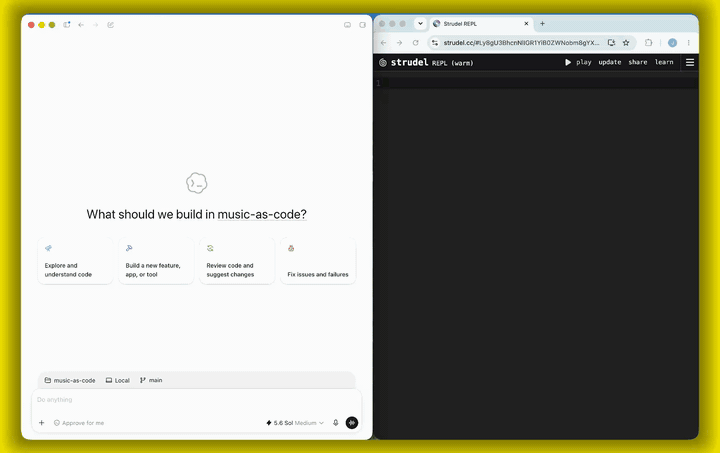
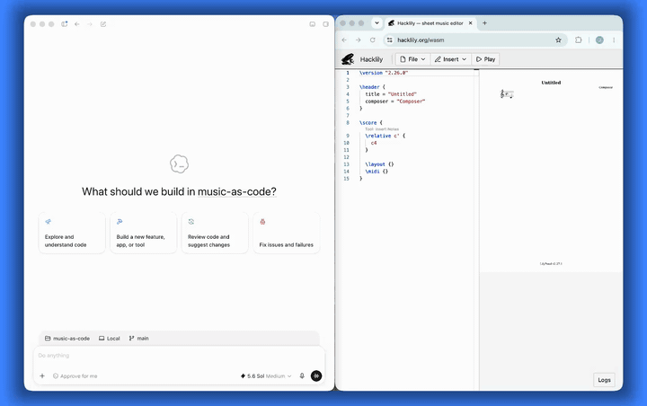

# music-as-code 🎵

Agent skills that turn natural-language music requests into local source
files you can edit, version, and play.

The composition is the source file. A chat response or audio preview is not a
substitute. Each skill writes that source, checks what it can locally, and
hands off to the official player or compiler.

<table>
  <tr>
    <th>Strudel</th>
    <th>LilyPond</th>
  </tr>
  <tr>
    <td width="50%"><a href="assets/strudel-example.mp4"></a><br><a href="assets/strudel-example.mp4">▶ Play with sound</a></td>
    <td width="50%"><a href="assets/lilypond-example.mp4"></a><br><a href="assets/lilypond-example.mp4">▶ Play with sound</a></td>
  </tr>
</table>

## 🧩 Skills

| Skill | Summary | Source |
| --- | --- | --- |
| Strudel | Playable live-coding music in local `.strudel.js` files. | [`skills/strudel`](skills/strudel) |
| LilyPond | Engraved scores in local `.ly` files, opened in Hacklily. | [`skills/lilypond`](skills/lilypond) |

## ⚙️ Installation

Install with the Skills CLI:

```sh
npx skills add Janjs/music-as-code
```

This installs the skills for the coding agents supported by the Skills CLI. Run
the same command again to update them.

### 🌀 Strudel

[Strudel](https://strudel.cc/) is a browser-based live-coding environment for
algorithmic music, based on the Tidal Cycles pattern language.

Each request produces a local `.strudel.js` file, a JavaScript syntax check,
and a playable `strudel.cc` link. Open the link and press play to hear it.

> **Codex users:** Open generated Strudel links in an external browser. The
> Codex internal browser may keep the previous editor state instead of loading
> the source encoded in the link.

Try it with an example prompt:

```text
Make a sparse 112 BPM dub-techno loop with restrained 909 drums,
a minor bass pulse, and hazy electric-piano chords.
```

### 🎼 LilyPond

[LilyPond](https://lilypond.org/) engraves scores from a text language.
[Hacklily](https://www.hacklily.org/wasm) is the browser editor: source in the
URL, score and playback in the page.

Each request produces a local `.ly` file and a Hacklily link. If `lilypond` is
installed locally, the agent can also compile PDF and MIDI next to the source
(`brew install lilypond`, or the installer from lilypond.org).

Try it with an example prompt:

```text
Write a short piano sarabande in D minor, two eight-bar phrases,
with a simple left-hand bass.
```

Compositions go in `music/`, which is gitignored.

## 📚 Strudel documentation

The Strudel skill ships with three references:

- [Code guide](skills/strudel/references/strudel-code-guide.md) for syntax,
  mini-notation, pattern functions, tempo, harmony, and effects
- [Sounds catalog](skills/strudel/references/strudel-sounds.md) for built-in
  samples, drum machines, synths, and wavetables
- [Official docs index](skills/strudel/references/official-docs.md) for current
  strudel.cc documentation grouped by task

The bundled guide and sounds list are snapshots. The skill uses the official
documentation when a function or sound is missing, ambiguous, or newer than
the bundled references.

## Repository layout

```text
skills/
  strudel/
    SKILL.md                    Agent instructions
    references/                 Code guide, sounds, and official docs index
    scripts/strudel-url.mjs     Builds a durable strudel.cc URL from a file
  lilypond/
    SKILL.md                    Agent instructions
    references/                 Language reference
    scripts/lilypond-url.mjs    Builds a durable Hacklily URL from a file
    scripts/lilypond-compile.mjs  Compiles a .ly file to PDF and MIDI
```

## ✅ Validation

Strudel: `node --check` catches JavaScript syntax errors, not missing Strudel
functions or sounds. The user discovers those by opening the REPL link and
pressing play.

```sh
node skills/strudel/scripts/strudel-url.mjs music/your-track.strudel.js
```

The REPL link uses the full source encoded in the URL fragment.

LilyPond: Hacklily engraves the source from the URL. Local `lilypond` is an
optional extra for PDF and MIDI files.

```sh
node skills/lilypond/scripts/lilypond-url.mjs music/your-score.ly
node skills/lilypond/scripts/lilypond-compile.mjs music/your-score.ly
```

The Hacklily link uses the full source encoded in the URL fragment. The compile
script exits 2 if `lilypond` is not on `PATH`.

## License

GNU Affero General Public License v3.0 or later. See [LICENSE](LICENSE).
